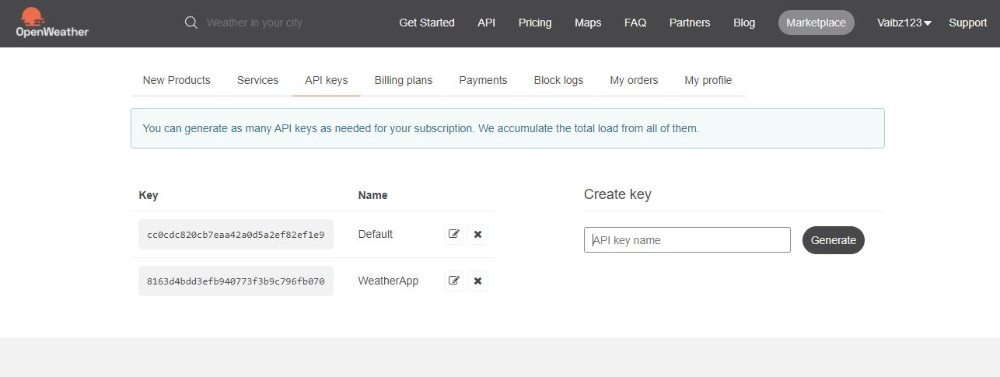
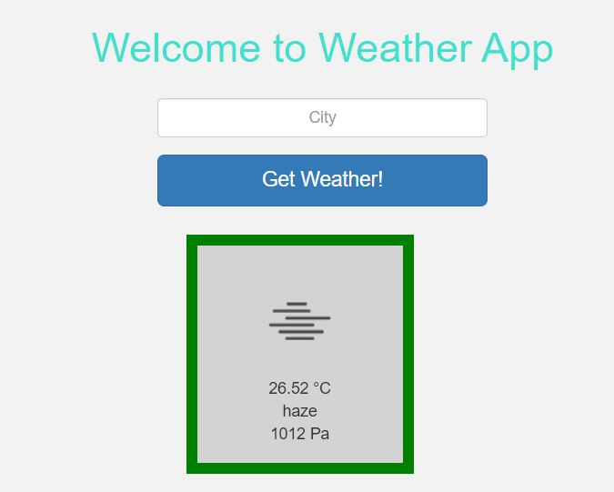

# Introduction 
Weather App displays current weather of place on entering location (i.e. city)
# Getting Started
1.	## Installation commands ##
-Run the following command from inside your app directory (i.e. where package.json is located) to 
install all dependencies:
### ->npm install ### 

2.	## Software dependencies: ##
    * Express
    * ejs 
    * request 
    * ts-node 

3.	## API references ##
The weather data will come from the [OpenWeatherMap API](http://api.openweathermap.org/api), and just like any other API, you need to sign up for an API key in order to use it. Go ahead and sign up for an account. Once you're logged in, go to the API keys page, copy the value of the key field and store it in __apiKey__ variable in _index.ts_ file.

#Technologies

* NodeJS
* TypeScript
* Express

# Build and Test
npm run start

#Overview 

